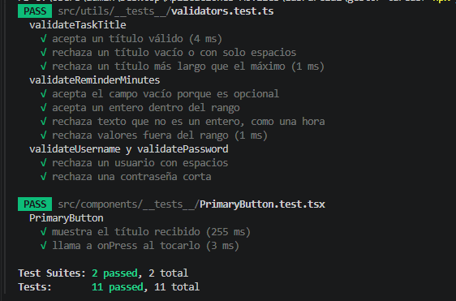

# Gestor de tareas

Parcial 1 – Aplicaciones Móviles. App móvil hecha con React Native y Expo (TypeScript).

## Opción elegida

**Gestor de tareas.**

## Cómo ejecutar la app

Requisitos: Node.js (probado con v24) y la app **Expo Go** en un celular Android, en una versión compatible con **Expo SDK 57**. El celular y la computadora deben estar en la misma red WiFi.

```bash
npm install
npx expo start
```

Luego escanear el código QR que aparece en la terminal con Expo Go.

Para correr los tests:

```bash
npm test
```

## Funcionalidades implementadas

- **Registro e inicio de sesión local** con usuario y contraseña, guardados en AsyncStorage. La sesión se mantiene al cerrar la app y no se puede acceder a las tareas sin iniciar sesión.
- **Tareas:** crear, listar, marcar como hechas (se tachan) y eliminar. Los datos se conservan al cerrar la app.
- **Recordatorio opcional:** al crear una tarea se puede indicar en cuántos minutos avisar. Se programa una **notificación local**.
- **Navegación** con React Navigation (Stack): Login, Registro, Home y Alta de tarea.
- **Componentes reutilizables:** `TaskItem` y `PrimaryButton`.
- **Tests** con Jest y React Native Testing Library (validaciones y componentes).

## Estructura del proyecto

```
src/
├── components/   piezas reutilizables (TaskItem, PrimaryButton)
├── context/      estado compartido (sesión y tareas)
├── hooks/        lógica de las tareas (useTasks)
├── navigation/   mapa de pantallas y navegador
├── screens/      pantallas (Login, Registro, Home, Alta)
├── services/     notificaciones locales
├── storage/      acceso a AsyncStorage (usuarios y tareas)
├── utils/        validaciones
└── types.ts      tipos (Task, User)
```


Video demo: <https://www.youtube.com/watch?v=j3MzlgxIgHs>

## Resultado de los tests


